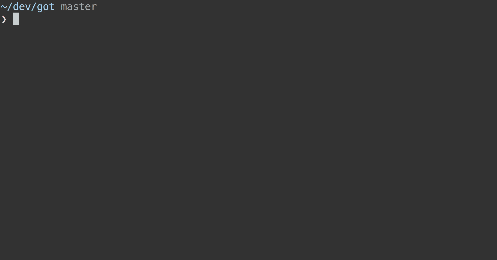

# pkg-upgrader 




Forked from [lib-upgrader](https://github.com/jfmengels/lib-upgrader) props to [@jfmengels](github.com/jfmengels) for starting this cool tool.

Codemods, or [`jscodeshift`](https://github.com/facebook/jscodeshift) transforms, are small programs that help automate changes in a codebase. Think of them as search and replace on steroids. This tool helps you to create a simple CLI to apply the codemods that you wrote, so that users can easily upgrade their code between various releases of your library.

## Install

```
$ yarn add pkg-upgrader jscodeshift
```


## Usage

Create a `cli.js` file at the root of your project that will serve as your modder executable, and add this sample code ([sample available here](sample/cli.js)):

```js
#!/usr/bin/env node
'use strict';

import modder from 'pkg-upgrader';
import pkg from './package.json';
import releases from './releases.json';

var settings = {
	libraryName: 'Your library name',
	releases: releases,
	pkg: pkg,
	dirname: __dirname
};

modder.handleCliArgs(settings)
	.then(modder.checkForUpdates)
	.then(modder.checkGitIsClean)
	.then(modder.prompt)
	.then(modder.applyCodemods)
	.then(modder.printTip)
	.catch(function (err) {
		console.error(err.message);
		process.exit(1);
	});

```

and create a `releases.json` file next to `cli.js`, which looks like the following ([sample available here](sample/releases.json)):

```json
[{
	"version": "0.14.0",
	"transforms": [
		"path/to/transform/a.js",
		"path/to/transform/b.js"
	]
}, {
	"version": "0.15.0",
	"transforms": [
		"path/to/transform/c.js",
		"path/to/transform/d.js"
	]
}, {
	"version": "1.0.0",
	"transforms": [
		"path/to/transform/e.js",
		"path/to/transform/f.js"
	]
}, {
	"version": "2.0.0",
	"transforms": [
		"path/to/transform/g.js",
		"path/to/transform/h.js"
	]
}]
```

Give execution right to your script
```
chmod +x script
```
and you should now be able to run the cli using
```
./cli.js
```

Unless you committed your changes and your directory is clean, when you run it, the program will exit and ask you to either commit or stash your changes. You can force through it by adding `--force` to the command line.

## License

MIT © [Jeroen Engels](http://github.com/jfmengels)
